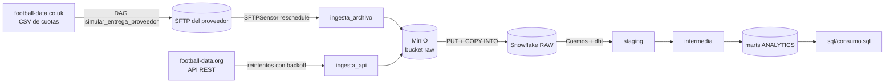

# Margen y acierto de las casas de apuestas

Pipeline de datos con Apache Airflow que responde, semana a semana en la Premier League,
**qué casa de apuestas cobra más margen y cuál predice mejor los resultados**.

Proyecto final del curso PEDE/9 Apache Airflow.

## El caso en 2 minutos

Cada casa publica una cuota para local, empate y visita. `1 / cuota` es la probabilidad
que sugiere esa cuota. Las tres deberían sumar 100 %, pero suman más: ese excedente
(*overround*) es la ganancia de la casa.

Ejemplo real, Liverpool vs. Bournemouth (15/08/2025), Bet365: cuotas 1,30 / 6,00 / 8,50 →
76,92 % + 16,67 % + 11,76 % = **105,35 %** → margen de **5,35 %**.

Quitando el margen se obtiene lo que la casa "cree" que va a pasar, y comparándolo con el
resultado real (Brier score) se mide qué tan bien predice. Ver [GLOSARIO.md](GLOSARIO.md).

## Arquitectura



1. **Ingesta**: un sensor espera el CSV de cuotas en el SFTP del proveedor; otra tarea baja
   los partidos de la API (límite de 10 consultas/minuto: reintentos con backoff exponencial).
2. **Staging**: todo lo crudo se guarda en MinIO (`raw/cuotas/fecha=<ds>/`,
   `raw/partidos/fecha=<ds>/`), para trazabilidad y reproceso.
3. **Carga**: Airflow sube los archivos a un stage interno de Snowflake (`PUT`) y los carga
   en `RAW` con `COPY INTO`. Es idempotente: re-correr la misma fecha no duplica.
4. **Transformación**: Cosmos ejecuta dbt como tareas de Airflow, con tests después de cada modelo.
5. **Consumo**: `mart_margen_por_casa` y `mart_acierto_por_casa`, consultados en `sql/consumo.sql`.

### DAGs

| DAG | Schedule | Qué hace |
|-----|----------|----------|
| `simular_entrega_proveedor` | Lunes 06:00 UTC | Baja el CSV de la temporada y lo deja en el SFTP (simula al proveedor) |
| `margen_casas_apuestas` | Lunes 07:00 UTC | El pipeline completo, organizado en 4 TaskGroups |

### Modelos dbt

| Capa | Modelo | Lógica |
|------|--------|--------|
| staging | `stg_cuotas` | Da vuelta el CSV: una fila por partido × casa × momento × resultado |
| staging | `stg_partidos` | Partidos de la API con los nombres de equipo del CSV (seed `equipos`) |
| intermedia | `int_probabilidades_implicitas` | 1/cuota, margen y probabilidad normalizada por mercado |
| mart | `mart_margen_por_casa` | Margen promedio, mínimo y máximo por casa, momento y jornada |
| mart | `mart_acierto_por_casa` | Brier score promedio y ranking por casa y momento |

Tests de dbt: `unique`, `not_null`, `relationships`, `accepted_values` y dos tests propios:
`probabilidades_suman_uno` (`severity: error`) y `cuota_mayor_a_uno` (`severity: warn`).

## Fuentes

| Fuente | Tipo | Qué trae |
|--------|------|----------|
| football-data.co.uk | Archivo CSV (entregado por SFTP) | Resultados y cuotas de apertura y cierre por casa |
| football-data.org API v4 | API REST con key | Calendario, jornada y estado de cada partido |

Si football-data.co.uk no responde, el DAG proveedor genera un CSV **simulado** con el
mismo formato (`include/apuestas/datos_simulados.py`), como permite el enunciado. Con la
Variable de Airflow `usar_datos_simulados` = `true` se fuerza la simulación.

## Estructura

| Carpeta | Contenido |
|---------|-----------|
| `dags/` | DAGs de Airflow (solo orquestación) |
| `include/apuestas/` | Lógica de negocio pura, probada con pytest |
| `dbt/apuestas/` | Proyecto dbt (staging, intermedia, marts, seeds y tests) |
| `tests/` | Tests de pytest (lógica, DAGs e integridad) |
| `sql/` | `setup.sql` (Snowflake) y `consumo.sql` (consultas finales) |
| `infra/minio/` | Inicialización de MinIO: bucket privado y usuario con permisos mínimos |
| `secrets/` | Llave privada de Snowflake (ignorada por git) |
| `sftp/entrada/` | Carpeta que expone el SFTP local |
| `.github/workflows/` | CI con GitHub Actions |

## Cómo levantarlo (Windows / PowerShell)

Requisitos: Docker Desktop con backend WSL2 (6 GB de RAM recomendados), Git y Python 3.12.

```powershell
git clone <url-del-repo>
cd margen-casas-apuestas

# 1. Crear el .env a partir de la plantilla y completar los valores
Copy-Item .env.example .env
notepad .env

# 2. Levantar todo (la primera vez tarda varios minutos: construye la imagen)
docker compose up -d --build

# 3. Verificar que los servicios estén arriba
docker compose ps
```

| Servicio | URL | Usuario |
|----------|-----|---------|
| Airflow | http://localhost:8080 | `_AIRFLOW_WWW_USER_USERNAME` del `.env` |
| MinIO (consola) | http://localhost:9001 | `MINIO_ROOT_USER` del `.env` |
| SFTP | `localhost:2222` | `SFTP_USER` del `.env` |

`airflow-init` y `minio-init` aparecen como `Exited (0)`: es lo esperado, son tareas
de una sola vez (migrar la base de Airflow y crear el bucket y el usuario de MinIO).

Para apagar: `docker compose down`. Para borrar además los datos: `docker compose down -v`.

## Configurar Snowflake (una sola vez)

El pipeline entra a Snowflake con un **usuario de servicio con llave RSA** (sin contraseña).

```powershell
# 1. Generar el par de llaves en secrets/ (la privada nunca va a git)
py -3.12 -m pip install cryptography
py -3.12 include/apuestas/llaves.py secrets
```

2. Abrir `sql/setup.sql`, reemplazar `<PEGAR_LLAVE_PUBLICA>` por la línea que imprimió el
   paso anterior y correr todo el script en Snowsight con `ACCOUNTADMIN`. Crea el warehouse
   (`XSMALL`, `AUTO_SUSPEND = 60`), la base, los esquemas `RAW` y `ANALYTICS`, el stage, el rol
   `PIPELINE_ROL` con permisos mínimos y el usuario `PIPELINE_USUARIO`.
3. Completar `SNOWFLAKE_ACCOUNT` en el `.env` (el identificador `<organizacion>-<cuenta>`
   que muestra Snowsight) y reiniciar: `docker compose up -d`.

Para la API: crear una key gratis en https://www.football-data.org/client/register y
ponerla en `FOOTBALL_DATA_API_KEY`.

## Correr el pipeline

1. En Airflow, activar `simular_entrega_proveedor` y `margen_casas_apuestas`.
2. Disparar `simular_entrega_proveedor` (▶): deja `entrada/E0.csv` en el SFTP.
3. Disparar `margen_casas_apuestas`: el sensor detecta el archivo y el pipeline corre completo.
4. Ver el resultado en Snowsight con `sql/consumo.sql`.

Si falta configuración, la tarea correspondiente falla de inmediato y dice qué completar
(por ejemplo, `Faltan valores de Snowflake en el .env: SNOWFLAKE_ACCOUNT`).

## Tests y CI

Airflow no corre de forma nativa en Windows, así que los tests se corren **dentro de la
imagen del proyecto** (ya trae Airflow, Cosmos y dbt). Con el stack levantado:

```powershell
docker compose run --rm --no-deps -v "${PWD}:/repo" -w /repo airflow-scheduler bash -c `
  "pip install -q pytest==8.3.4 ruff==0.5.5 && python -m ruff check . && python -m pytest -q -p no:cacheprovider"
```

Esperado: `All checks passed!` y `72 passed`.

| Archivo de tests | Qué prueba |
|------------------|------------|
| `test_cuotas.py` | Lector del CSV (BOM, fechas, columnas faltantes) y cálculos: margen, normalización, Brier |
| `test_football_data.py` | Cliente de la API con respuestas simuladas: 429 → reintento, 401/403 → error sin reintentar |
| `test_snowflake_carga.py` | Sentencias de carga (orden, validación contra inyección) y validación de configuración |
| `test_datos_simulados.py` | El CSV simulado pasa por el lector real y tiene márgenes creíbles |
| `test_llaves.py` | Generación del par de llaves de Snowflake |
| `test_dag_principal.py` | Estructura del DAG: schedule, TaskGroups, sensor en reschedule, backoff, dbt después de la carga |
| `test_integridad_dags.py` | Todos los DAGs importan, tienen owner, `doc_md` y `catchup=False` |

GitHub Actions corre en cada Pull Request: instala Airflow con sus constraints y dbt en su
propio venv, valida el proyecto dbt (`dbt parse`), corre `ruff` y `pytest`. `main` está
protegida: no se puede mergear sin el check `lint-y-tests` en verde.

## Decisiones de diseño

| Decisión | Por qué |
|----------|---------|
| Airflow 2.10.5 con LocalExecutor | Versión del curso; LocalExecutor usa menos RAM que Celery y alcanza para una máquina |
| dbt en un virtualenv aparte | Sus dependencias chocan con las de Airflow; Cosmos lo llama por ruta |
| Filas como VARIANT (JSON) en `RAW` | Si la fuente agrega o quita columnas, la carga no se rompe; dbt decide qué leer |
| `PUT` a stage interno + `COPY INTO` | Snowflake está en la nube y no ve el MinIO local |
| Carga idempotente por fecha | `DELETE` de la fecha + `COPY ... FORCE`: re-correr no duplica |
| Sensor con `newer_than` | Espera el archivo de esta semana, no reprocesa el de la anterior |
| Errores de configuración con `AirflowFailException` | Una key inválida o un CSV mal formado no se arreglan reintentando |
| MinIO de Chainguard | La imagen oficial de MinIO dejó de publicarse en Docker Hub |
| Usuario de MinIO con permisos solo sobre `raw` | Permisos mínimos: si se filtra, el daño queda acotado |
| Usuario de servicio de Snowflake con llave RSA | Sin contraseñas en el `.env`; rol con permisos mínimos |
| Triggerer en el compose | Necesario para sensores *deferrable* |

## Seguridad

- Ninguna credencial en el código ni en git: todo sale del `.env` (ignorado) y de `secrets/`.
- Connections de Airflow definidas por variables de entorno (`AIRFLOW_CONN_*`).
- `profiles.yml` de dbt solo con `env_var()`.
- Bucket `raw` privado, sin acceso anónimo.
- Rol de Snowflake `PIPELINE_ROL`: carga en `RAW` y crea modelos en `ANALYTICS`, nada más.
